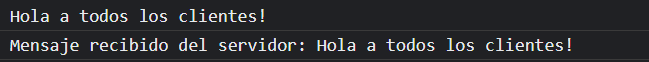
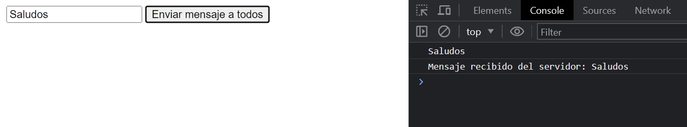
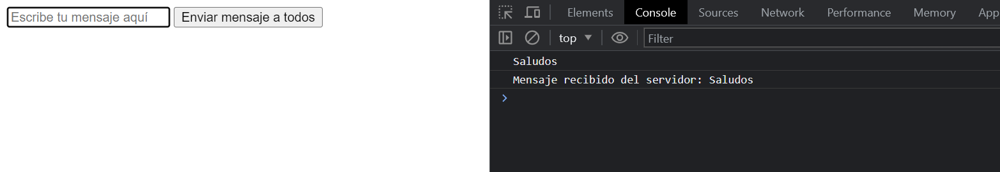

## Archivos
### Index.js Server file
### Front.js with index.html Client file

Si te regristas antes de ese tiempo, recibiras este mensaje.

```javascript setTimeout(() => {
  broadcastMessage("Hola a todos los clientes!");
}, 5000);
```


Con el input que esta en index.html puedes enviar mensaje a todos los sockets, incluyendo al usuario que envio el mensaje.

Ventana 1


Ventana 2 


